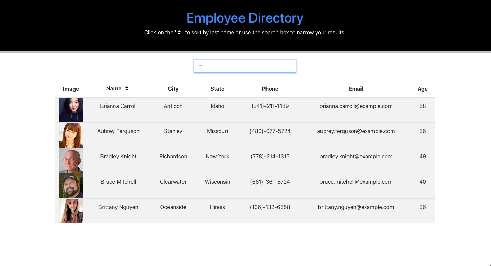

# DJP-Employee-Directory

## A React app for sorting and filtering employees  

  

## Table of Contents

* [Description](#description)
* [Installation](#installation)
* [Usage](#usage)
* [License](#license)
* [Contributing](#contribution)
* [Tests](#tests)
* [Questions](#questions)

## Description 

This application essentially queries from an API to retrieve random users (employees), allows for the sorting of the results alphabetically by nam on a click event, and allows for the filtering of names by letters inputted into the search form field. I made it really just to work further with ReactJS.  

On page load...
  

With list sorted alphabetically...
  

With list filtered per string...
  

## Installation

You can see a deployment of the application [on Heroku at this link](https://djp-employee-tracker.herokuapp.com/), but if you'd like to install it and see it operating from your local computer, clone the repo here in Github. From the command line, run 'npm install', and then run 'npm start'. 

## Usage 

The app is not really designed to be 'used', but to show some simple ways that ReactJS works. However, to use it, simply click on the sort button in order to sort the employee results into alphabetical order, and click it again to reverse sort. Type a name or partial name into the search input in order to see any names that include that string you type. 

## License

This application is covered under a [MIT License](https://opensource.org/licenses/MIT).

## Contributing

To contribute, create a pull request: 
* Fork the repo
* Create a feature branch (git checkout -b NAME-HERE)
* Commit new feature (git commit -m "Message about new feature")
* Push your branch (git push)
* Create new pull request

Your code will be reviewed and merged.

## Tests

There are currently no tests for this application.

## Questions

Got questions? Feel free to contact me.  
Github username: [domjparker](https://github.com/domjparker)  

---

© 2020, Dominic Parker. All Rights Reserved.

